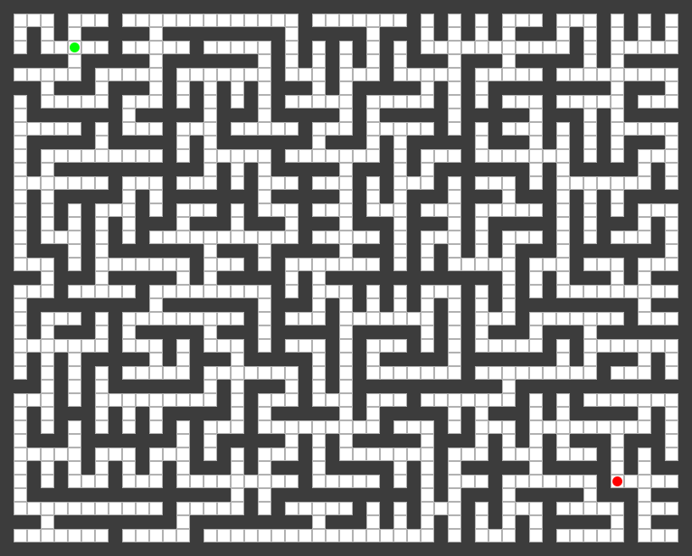

# Maze Master

[](https://www.oracle.com/java/)
[](https://github.com/Aman-Agnihotri/Minor_1/actions/workflows/ci.yml)
[](https://gradle.org/)
[](https://docs.oracle.com/javase/tutorial/uiswing/)
[](LICENSE)

Maze Master is a Java Swing desktop app for generating, solving, saving, and exporting mazes. It started as an early college project and has since been refactored into a cleaner MVC-style application with pluggable algorithms, reproducible seeds, pause/resume animation, versioned persistence, and automated tests.



## What This Demonstrates

- MVC-style separation between model, controller, and Swing view code
- Strategy pattern for interchangeable generation and solving algorithms
- Seeded maze generation for reproducible results
- Pause/resume support for long-running animated operations
- Versioned save/load format with backward-compatible parsing
- Export support for PNG snapshots and animated GIFs
- JUnit coverage for model, controller, generation, solving, persistence, and export behavior

## Features

- Generate mazes with Depth-First Search, Kruskal, or Prim
- Solve mazes with Depth-First Search, Breadth-First Search, or A*
- Pause and resume generation or solving without losing progress
- Recreate mazes from a seed, dimensions, and algorithm
- Move the start and goal markers directly on the generated maze
- Save and load maze files with seed, algorithm, start, and goal metadata
- Export the current maze as PNG or the most recent animation as GIF
- Track generation time, solving time, walkable cells, explored cells, explored percentage, path length, and result
- Persist window size, position, zoom level, and animation speed

## Quick Start

### Requirements

- Java 17 or newer
- No separate Gradle install required; the Gradle wrapper is included

### Build, Test, and Run

```bash
./gradlew test
./gradlew build
./gradlew runApp
```

Run the generated executable JAR:

```bash
java -jar build/libs/maze-master-2.0.0.jar
```

On Windows, use `gradlew.bat` instead of `./gradlew`.

## Usage Flow

1. Set the row and column count in the side panel.
2. Choose a generation algorithm.
3. Use the random seed or enter your own seed.
4. Click `New Maze` to create a blank workspace.
5. Click `Generate` to animate maze generation.
6. Click the green or red endpoint marker, then click another open cell to move it.
7. Choose a solving algorithm.
8. Click `Solve` to animate pathfinding.
9. Use `Save`, `Load`, `Export`, or `GIF` to preserve the result.

`New Maze` intentionally creates a blank workspace. `Generate` runs the selected algorithm on that workspace. The seed `Create` control creates and generates a maze from the seed field.

## Controls

| Control | Purpose |
| --- | --- |
| `New Maze` | Create a blank maze workspace from the current dimensions |
| `Generate` | Generate a maze with the selected generation algorithm |
| `Solve` | Solve the current generated, reachable maze with the selected solving algorithm |
| `Pause` / `Resume` | Pause or resume the active generation/solving operation |
| `Reset` | Clear the solution, or clear an unfinished/paused generation |
| `Save` / `Load` | Persist or restore a maze file |
| `Export` | Export the visible maze as PNG |
| `GIF` | Export the most recent generation or solving animation |
| Mouse wheel | Zoom the maze view in or out |
| Seed `Random` | Generate a new random seed value |
| Seed `Create` | Generate a maze from the current seed and dimensions |
| Metrics panel | Shows generation time, solving time, walkable cells, explored percentage, path length, and result |

### Reset Behavior

| Maze State | Reset Action |
| --- | --- |
| Generated maze | Clears solution markings and keeps the maze structure |
| Blank maze | Leaves the blank workspace as-is |
| Paused generation | Stops generation and clears back to a blank workspace |
| Paused solving | Clears solving progress and keeps the generated maze |
| Running generation or solving | Reset is disabled until the operation is paused |

## Algorithms

### Generation

| Algorithm | Notes |
| --- | --- |
| Depth-First Search | Recursive-backtracking style generation with long corridors |
| Kruskal | Minimum-spanning-tree style generation using disjoint sets |
| Prim | Frontier-based randomized generation |

### Solving

| Algorithm | Notes |
| --- | --- |
| Depth-First Search | Finds a path, but not necessarily the shortest path |
| Breadth-First Search | Finds the shortest path in the unweighted maze graph |
| A* | Uses Manhattan distance to guide shortest-path search |

## Architecture

```text
src/main/java/com/mazemaster/
├── MazeMasterApplication.java
├── controller/
│   └── MazeController.java
├── export/
│   └── AnimatedGifExporter.java
├── generation/
│   ├── DepthFirstSearchGenerator.java
│   ├── KruskalGenerator.java
│   ├── MazeGenerationContext.java
│   ├── MazeGenerationStrategy.java
│   ├── MazeGenerator.java
│   ├── PrimGenerator.java
│   └── Wall.java
├── model/
│   └── Maze.java
├── persistence/
│   └── MazeFileService.java
├── solving/
│   ├── AStarSolver.java
│   ├── BreadthFirstSearchSolver.java
│   ├── DepthFirstSearchSolver.java
│   ├── MazeSolver.java
│   ├── MazeSolvingContext.java
│   └── MazeSolvingStrategy.java
└── ui/
    ├── MazeView.java
    └── swing/
        ├── MazePanel.java
        └── SwingMazeView.java
```

The controller coordinates user actions, background execution, persistence, and view updates. Generation and solving are delegated to strategy classes through small context objects that provide callbacks, pause/resume checks, cancellation checks, and animation timing.

Detailed architecture notes are available in [docs/architecture.md](docs/architecture.md).

## Persistence Format

Maze files use a text format managed by `MazeFileService`. The current format stores:

- format version
- dimensions
- seed and generation algorithm
- start and goal coordinates
- cell grid state

Older save versions are still loaded where possible so the format can evolve without breaking existing maze files.

## Testing

The test suite covers the core behaviors that are most likely to regress:

- maze bounds, metadata, and endpoint validation
- deterministic generation from seeds
- generation and solving completion behavior
- controller state transitions
- save/load format validation
- GIF export behavior

Run all tests with:

```bash
./gradlew test
```

## Release Build

Create the executable JAR:

```bash
./gradlew build
```

Run it:

```bash
java -jar build/libs/maze-master-2.0.0.jar
```

## Project History

This repository began as a second-year college project focused on visual maze generation. The current version keeps the original idea but hardens the implementation: algorithm logic is split into strategies, UI work is isolated behind a controller/view boundary, save files are versioned, generation can be reproduced from seeds, and the important behavior is covered by tests.

## License

This project is licensed under the [MIT License](LICENSE).
